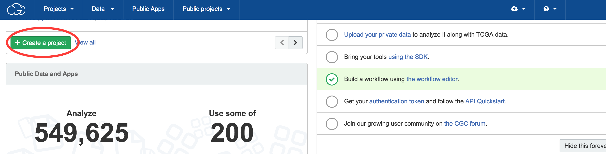
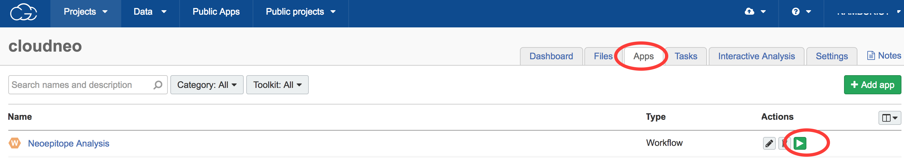
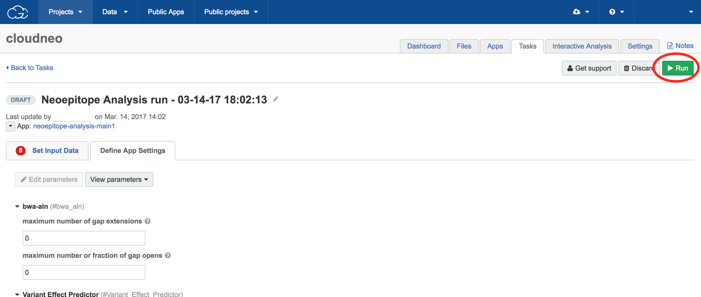
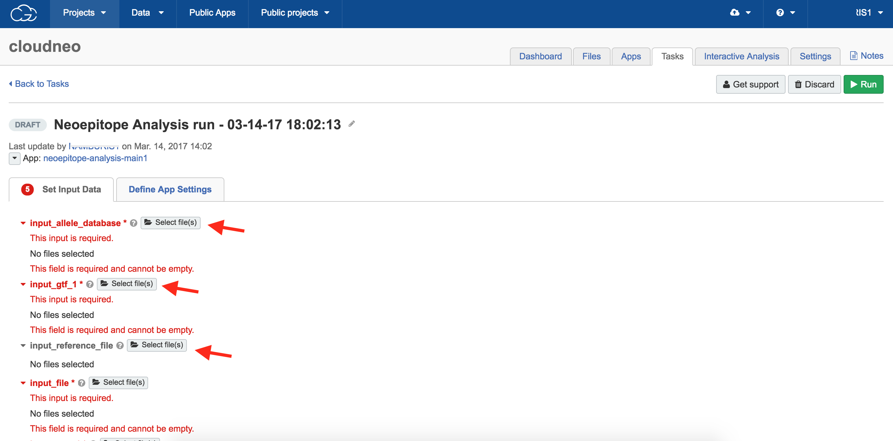
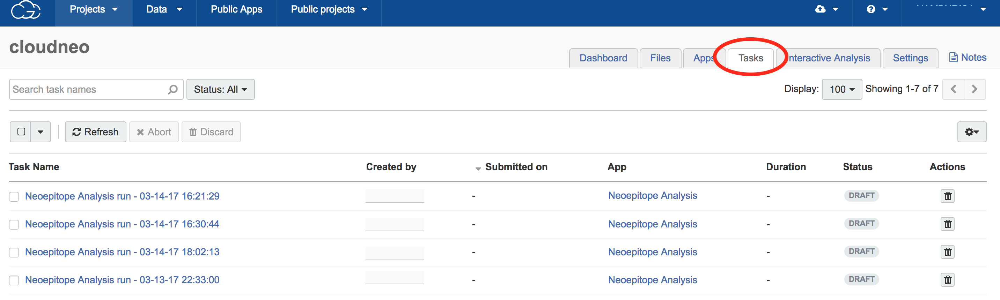

Register for an account
------------------------
Register for a account with the `Seven Bridges Cloud Platform <http://www.cancergenomicscloud.org/>`_.

Create a Project
--------------------------------------------
Login to the account and create a `project <http://docs.sevenbridges.com/docs/projects-on-the-platform>`_ to do your analysis. Projects act as a container to store your data, apps, workflows. You can create a project by clicking on 'Create a Project' button, as highlighted in the below screenshot.

.. seealso::  More information on how to create a `project <http://docs.sevenbridges.com/docs/projects-on-the-platform>`_
 is `available here <http://docs.sevenbridges.com/docs/create-a-project>`_.

Accessing the CloudNeo App
---------------------------------
After creating the account and the project, please contact the author `Dr. Chuang <Jeff.Chuang@jax.org>`_ for access to the CloudNeo app. Workflows and Tools are called `Apps <http://docs.sevenbridges.com/docs/public-apps>`_ on Seven Bridges CGC platfrom. There are two ways we could provide access to the app:

* You can add one of the authors as a temporary team member to your project. The team member would then copy the app to the project.
* We could also add you as a temporary member to one of our projects. You will be able to access and copy the app to your own project.

.. seealso::  More information on `adding a member <http://docs.sevenbridges.com/docs/add-a-collaborator>`_
 to the project.

Running the CloudNeo App
---------------------------------

Creating a draft task
^^^^^^^^^^^^^^^^^^^^^
Once the App as been copied to your project, it will be available in the 'Apps' tab as shown below in the example screenshot.

Next, click on the 'Run' button (highlighted in the  screenshots) to create a draft task.

.. seealso::  More information on how to create a `project <http://docs.sevenbridges.com/docs/projects-on-the-platform>`_
 is `available here <http://docs.sevenbridges.com/docs/create-a-project>`_.

Select input files
^^^^^^^^^^^^^^^^^^^^^
Add the files that you would like to analyze to the project. The files must be in the project to select it as input. All the inputs are required for the CloudNeo app.

.. seealso:: More information on `uploading the files <http://docs.sevenbridges.com/docs/upload-to-the-seven-bridges-platform>`_ to the project.

Define app settings
^^^^^^^^^^^^^^^^^^^^^
The Seven Bridges CGC interface allowing you to change the app's setting before you submit the task. Click on the 'App Settings' tab to change any parameters. This is an optional step and the CloudNeo pipeline has a set of defaults that can be used.

.. image:: ../images/define-settings.png
    :width: 300px
    :align: center
    :height: 100px
    :alt: alternate text

Run the Analysis/Task
^^^^^^^^^^^^^^^^^^^^^
Click on the 'Run' button (green button - shown below) to submit the task. 

.. seealso::  More information on how to `submit a task <http://docs.sevenbridges.com/docs/perform-batch-analysis>`_.

View submitted Tasks
^^^^^^^^^^^^^^^^^^^^^
The tasks submitted can be view in the 'Tasks' tabs as shown below.

.. seealso::  More information on how to `view tasks <http://docs.sevenbridges.com/docs/review-task-page>`_.

.. note:: The `entire documentation <http://docs.sevenbridges.com/docs/quickstart>`_ about the Seven Bridges Genomics Platfrom is `here <http://docs.sevenbridges.com/docs/quickstart>`_, along with the `tutorials <http://docs.sevenbridges.com/docs/seven-bridges-platform-tutorials>`_.
