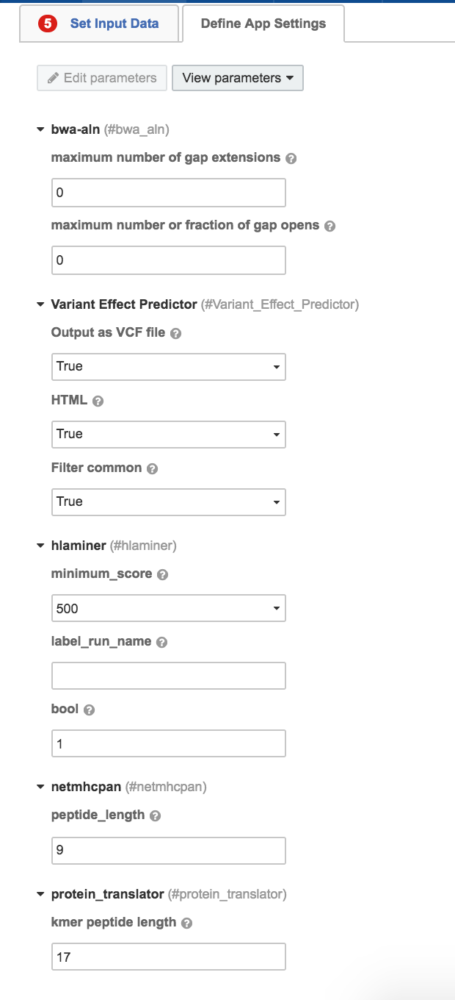

App Settings
==============

.. toctree::
   :maxdepth: 1

Settings Defaults
------------------
.. csv-table::
   :header: "**ID**", "**Label**", "**Type**", "**Required**", "**Prefix**", "**Default**"
   :widths: 50, 50, 50, 50, 50, 50

   num_gap_extensions,maximum number of gap extensions,int,No,-e,0
   maximum_number_of_gap_opens,maximum number or fraction of gap opens,int,No,-o,0
   vcf,Output as VCF file,boolean,No,--vcf,TRUE
   html,HTML,boolean,No,--html,TRUE
   filter_common,Filter common,boolean,No,,TRUE
   minimum_score,,enum,No,-s,500
   label_run_name,,string,No,-l,
   bool_single_end_reads_used,bool,int,No,-e,1
   peptide_length,peptide_length,int,No,,9
   kmer_peptide_length,kmer peptide length,int,No,,17
