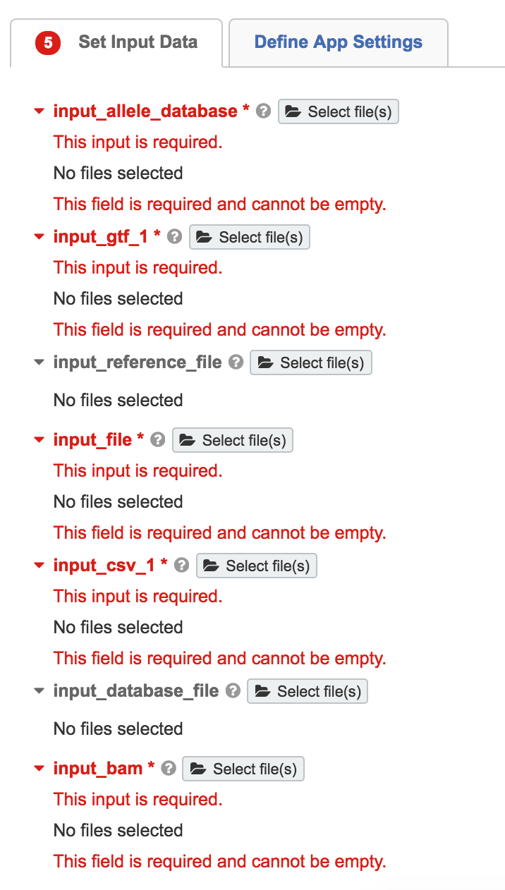

Inputs
=======

.. toctree::
   :maxdepth: 1

Input Details
----------------
.. csv-table::
   :header: "**ID**", "**Label**", "**Type**", "**Required**", "**Format**"
   :widths: 50, 50, 50, 10, 10

   input_bam,input_bam,File,Yes,BAM
   input_reference_file,input_reference_file,File,Yes,TAR.GZ
   input_file,input_file,File,Yes,VCF TXT
   input_database_file,input_database_file,File,Yes,FASTA
   input_allele_database,input_allele_database,File,Yes,fasta
   input_gtf,input_gtf_1,File,Yes,GTF
   input_csv,input_csv_1,File,Yes,CSV

**input_bam** 
  Input BAM file to call neoepitopes

**input_reference_file** 
  This is the Variant Effect Predictor reference file. This can be downloaded from the following link.  `homo_sapiens_vep_83_GRCh37.tar.gz <http://ftp.ensembl.org/pub/grch37/release-83/variation/VEP/homo_sapiens_vep_83_GRCh37.tar.gz>`_

**input_file**
  Input VCF file to call neoepitopes

**input_database_file**
  This is the IMGT hla_prot.fasta file for input to netmhcpan. The input file must be formatted as below:

.. code-block:: perl
 
  # The header in this file must be formated and renamed as netmhcpan-3.0.imgt.fasta
  cat hla_prot.fasta |  perl -ne 'chomp;if(/\>\S+\s+(\S+)/){print ">$1\n";}else{print "$_\n";}' > netmhcpan-3.0.imgt.fasta

**input_allele_database**
  This is the Hlaminer/IMGT database file: `HLA-I_II_CDS.fasta <https://github.com/warrenlr/HLAminer/blob/master/HLAminer_v1.3.1/database/HLA-I_II_CDS.fasta>`_. The reference files can be obtained from the same link. (all files starting with HLA-I_II_CDS.* must be copied)

.. note:: instructions to build the IMGT/HLA database are here on `hlaminer github repository <https://github.com/warrenlr/HLAminer/tree/master/HLAminer_v1.3.1/database>`_.

**input_gtf**
  Input Homo sapiens GTF file from Ensembl: `Homo_sapiens.GRCh37.75.gtf.gz <https://github.com/TheJacksonLaboratory/CloudNeo/wiki/reference_files/HumanProteins.GRCh37.75.csv>`_.

**input_csv**
  Human Proteins (GRCh37.75) file: `HumanProteins.GRCh37.75.csv <https://github.com/TheJacksonLaboratory/CloudNeo/wiki/reference_files/HumanProteins.GRCh37.75.csv>`_.
